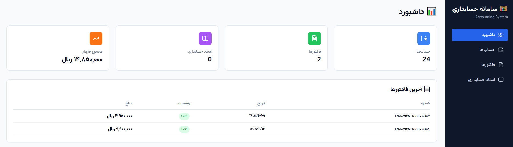
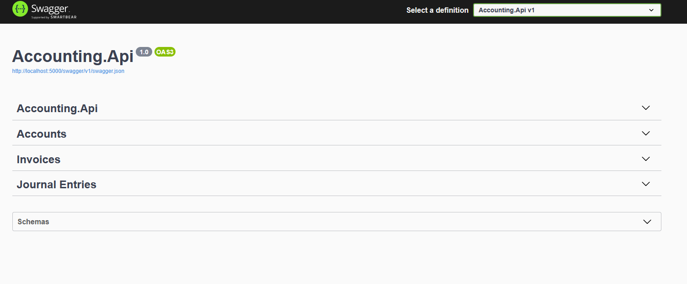
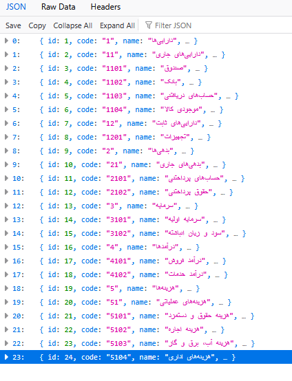
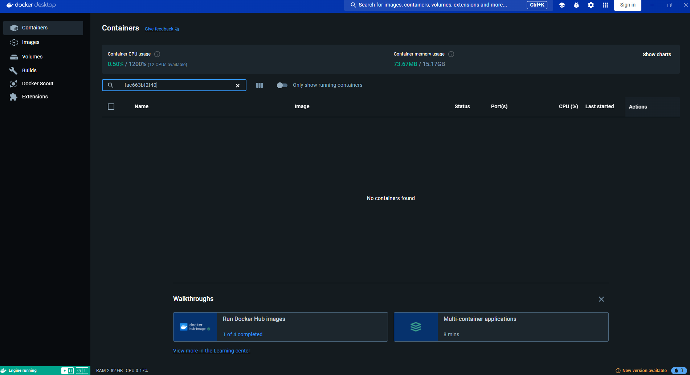
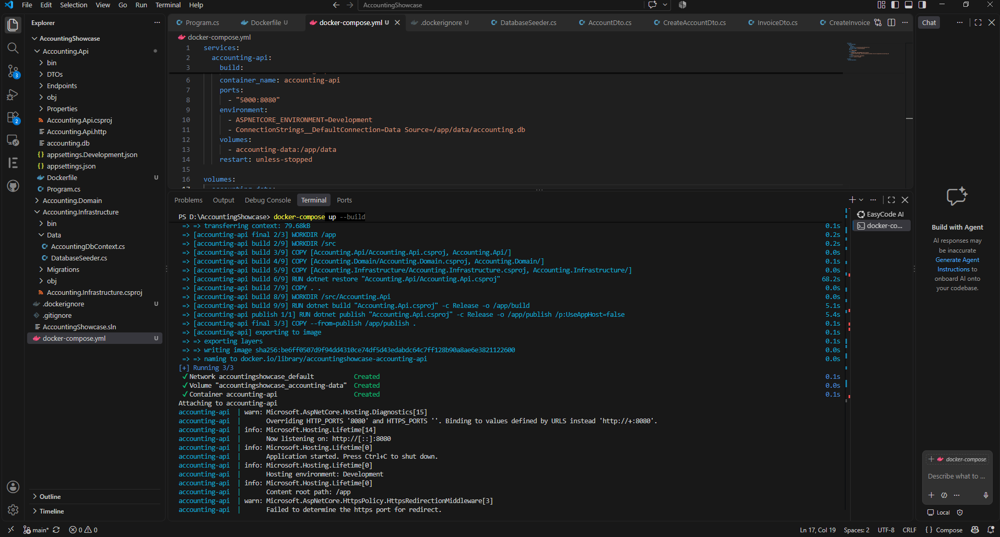

# 🧮 Accounting Showcase

> A production-ready **Full-Stack Accounting System** built with ASP.NET Core 8, React 19, and Clean Architecture.

[](https://dotnet.microsoft.com/)
[](https://learn.microsoft.com/ef/core/)
[](https://react.dev/)
[](https://www.typescriptlang.org/)
[](https://tailwindcss.com/)
[](https://www.docker.com/)
[](LICENSE)

---

## 📖 Overview

**Accounting Showcase** is a full-featured, bilingual (Persian/English) accounting system designed to demonstrate enterprise-grade architecture, Clean Architecture principles, and modern full-stack development practices.

This project showcases:
- 🏗️ **Clean Architecture** — Domain, Infrastructure, and API layers
- 💼 **Complete accounting model** — Chart of accounts, Invoices, Journal entries
- 📊 **Double-entry bookkeeping** — Balanced journal entries validation
- 🗄️ **Entity Framework Core 8** — Code-first with SQLite
- 🚀 **Minimal API** — Modern, fast endpoints with Swagger
- ⚛️ **React 19 + TypeScript** — Modern, typed frontend
- 🎨 **Tailwind CSS + shadcn/ui** — Beautiful, responsive UI
- 🌐 **RTL Persian UI** — Full right-to-left support with Vazirmatn font
- 🐳 **Docker-ready** — One-command setup for backend
- 📦 **Seed data** — Standard chart of accounts included

---

## 📸 Screenshots

### 🖥️ Full-Stack Dashboard (React + ASP.NET Core)



> Modern dashboard built with React 19, TypeScript, Tailwind CSS, and shadcn/ui — connected to the ASP.NET Core API.

### 📋 Swagger API Documentation

<table>
  <tr>
    <td width="50%" align="center">
      <strong>Swagger UI</strong><br>
      
    </td>
    <td width="50%" align="center">
      <strong>Chart of Accounts</strong><br>
      
    </td>
  </tr>
</table>

### 🐳 Docker & Development

<table>
  <tr>
    <td width="50%" align="center">
      <strong>Docker Container</strong><br>
      
    </td>
    <td width="50%" align="center">
      <strong>VS Code</strong><br>
      
    </td>
  </tr>
</table>

---

## 🏗️ Architecture

```
AccountingShowcase/
│
├── Accounting.Domain/              # Core business logic (Entities + Enums)
│   ├── Entities/
│   │   ├── BaseEntity.cs          # Base class (Id, CreatedAt, UpdatedAt)
│   │   ├── Account.cs             # حساب (Chart of Accounts)
│   │   ├── Invoice.cs             # فاکتور فروش
│   │   ├── InvoiceItem.cs         # ردیف فاکتور
│   │   ├── JournalEntry.cs        # سند حسابداری
│   │   └── JournalLine.cs         # ردیف سند
│   └── Enums/
│       ├── AccountType.cs         # Asset, Liability, Equity, Revenue, Expense
│       ├── InvoiceStatus.cs       # Draft, Sent, Paid, Overdue, Cancelled
│       └── JournalEntryStatus.cs  # Draft, Posted, Reversed
│
├── Accounting.Infrastructure/     # Data access layer (EF Core)
│   ├── Data/
│   │   ├── AccountingDbContext.cs # EF Core DbContext
│   │   └── DatabaseSeeder.cs      # Seed 25 standard accounts
│   └── Migrations/                # EF Core migrations
│
├── Accounting.Api/                # Web API (ASP.NET Core Minimal API)
│   ├── DTOs/                      # Data Transfer Objects
│   ├── Endpoints/                 # REST endpoints
│   ├── Program.cs                 # Application entry point
│   ├── appsettings.json           # Configuration
│   └── Dockerfile                 # Multi-stage Docker build
│
├── frontend/                      # React + TypeScript UI
│   ├── src/
│   │   ├── api/                   # Axios API clients
│   │   │   ├── axios.ts
│   │   │   ├── accounts.ts
│   │   │   ├── invoices.ts
│   │   │   └── journalEntries.ts
│   │   ├── components/
│   │   │   ├── layout/            # Sidebar, Layout
│   │   │   └── ui/                # shadcn/ui components
│   │   ├── pages/                 # Route pages
│   │   │   ├── Dashboard.tsx
│   │   │   ├── Accounts/
│   │   │   ├── Invoices/
│   │   │   └── JournalEntries/
│   │   ├── types/                 # TypeScript types
│   │   ├── lib/                   # Utilities
│   │   ├── App.tsx
│   │   ├── main.tsx
│   │   └── index.css
│   ├── package.json
│   ├── tailwind.config.js
│   └── vite.config.ts
│
├── screenshots/                   # Project screenshots
├── docker-compose.yml             # Docker Compose configuration
├── AccountingShowcase.sln         # Solution file
└── README.md
```

---

## ✨ Features

### 🎯 Complete Accounting Model

| Entity | Description |
|--------|-------------|
| **Account** | Chart of accounts with hierarchical structure (Assets, Liabilities, Equity, Revenue, Expenses) |
| **Invoice** | Sales invoices with items, tax, and status tracking |
| **InvoiceItem** | Invoice line items with auto-calculation |
| **JournalEntry** | Double-entry accounting journal with balanced validation |
| **JournalLine** | Debit/Credit lines with account references |

### 🔐 Double-Entry Bookkeeping

Every journal entry is validated:
```
Total Debit = Total Credit
```

API returns `400 Bad Request` if not balanced.

### 📦 Standard Chart of Accounts

Included seed data (**25 accounts**):

- **1** — دارایی‌ها (Assets)
  - **11** — دارایی‌های جاری
    - **1101** صندوق، **1102** بانک، **1103** حساب‌های دریافتنی، **1104** موجودی کالا
  - **12** — دارایی‌های ثابت
    - **1201** تجهیزات
- **2** — بدهی‌ها (Liabilities)
  - **21** — بدهی‌های جاری
    - **2101** حساب‌های پرداختنی، **2102** حقوق پرداختنی
- **3** — سرمایه (Equity)
  - **3101** سرمایه اولیه، **3102** سود و زیان انباشته
- **4** — درآمدها (Revenue)
  - **4101** درآمد فروش، **4102** درآمد خدمات
- **5** — هزینه‌ها (Expenses)
  - **51** — هزینه‌های عملیاتی
    - **5101** حقوق، **5102** اجاره، **5103** آب و برق، **5104** اداری

### 🌐 Bilingual Support

- **Persian (RTL)** primary UI with **Vazirmatn** font
- **Persian number formatting** (`Intl.NumberFormat('fa-IR')`)
- **Persian date formatting** (`toLocaleDateString('fa-IR')`)
- **English** in API/Swagger docs

### 🎨 Modern UI

- **Tailwind CSS** for utility-first styling
- **shadcn/ui** components (Button, Card, Input, Table, Dialog, Form, ...)
- **Lucide React** icons
- **React Router v6** for routing
- **TanStack Query** for server state management
- **Recharts** for charts (coming soon)

---

## 🚀 Quick Start

### Prerequisites

- [.NET 8 SDK](https://dotnet.microsoft.com/download)
- [Node.js 22+](https://nodejs.org/)
- [Docker Desktop](https://www.docker.com/products/docker-desktop/) (optional, for containerized run)

### Option 1: Docker (Backend Only)

```bash
git clone https://github.com/omid-sakaki-ghazvini/aspnet-accounting-showcase.git
cd aspnet-accounting-showcase
docker-compose up --build
```

- API: **http://localhost:5000**
- Swagger: **http://localhost:5000/swagger**

### Option 2: Local Development (Full Stack)

#### 1. Backend

```bash
# In root folder
cd Accounting.Api
dotnet run
```

Backend will be available at: **http://localhost:5232**

#### 2. Frontend

```bash
# In a new terminal
cd frontend
npm install
npm run dev
```

Frontend will be available at: **http://localhost:5173**

#### 3. Configure API URL (if needed)

Create `frontend/.env`:

```env
VITE_API_URL=http://localhost:5232
```

---

## 🔌 API Endpoints

### Accounts

| Method | Endpoint | Description |
|--------|----------|-------------|
| GET | `/api/accounts` | List all accounts |
| GET | `/api/accounts/{id}` | Get account by ID |
| POST | `/api/accounts` | Create new account |
| DELETE | `/api/accounts/{id}` | Delete account |

**Example: Create Account**
```json
POST /api/accounts
{
  "code": "1105",
  "name": "تنخواه گردان",
  "type": 1,
  "parentAccountId": 2,
  "description": "تنخواه گردان اداری"
}
```

### Invoices

| Method | Endpoint | Description |
|--------|----------|-------------|
| GET | `/api/invoices` | List all invoices |
| GET | `/api/invoices/{id}` | Get invoice by ID |
| POST | `/api/invoices` | Create new invoice |
| DELETE | `/api/invoices/{id}` | Delete invoice |

**Example: Create Invoice**
```json
POST /api/invoices
{
  "taxAmount": 900000,
  "notes": "فاکتور نمونه",
  "items": [
    { "description": "خدمات مشاوره", "quantity": 1, "unitPrice": 5000000 },
    { "description": "پشتیبانی ماهانه", "quantity": 2, "unitPrice": 2000000 }
  ]
}
```

### Journal Entries

| Method | Endpoint | Description |
|--------|----------|-------------|
| GET | `/api/journal-entries` | List all journal entries |
| POST | `/api/journal-entries` | Create new journal entry |
| DELETE | `/api/journal-entries/{id}` | Delete journal entry |

**Example: Create Balanced Journal Entry**
```json
POST /api/journal-entries
{
  "description": "فروش نقدی",
  "reference": "INV-20261005-0001",
  "lines": [
    { "accountId": 3, "debit": 1000000, "credit": 0 },
    { "accountId": 17, "debit": 0, "credit": 1000000 }
  ]
}
```

---

## 🛠️ Tech Stack

### Backend

| Category | Technology |
|----------|-----------|
| Framework | ASP.NET Core 8.0 |
| ORM | Entity Framework Core 8.0.10 |
| Database | SQLite (dev) / PostgreSQL-ready |
| API Style | Minimal API |
| Documentation | Swagger / OpenAPI |
| Architecture | Clean Architecture |

### Frontend

| Category | Technology |
|----------|-----------|
| Framework | React 19 |
| Language | TypeScript 5.x |
| Build Tool | Vite 8 |
| Styling | Tailwind CSS 3.x |
| UI Components | shadcn/ui |
| Routing | React Router v6 |
| State Management | TanStack Query v5 |
| HTTP Client | Axios |
| Icons | Lucide React |
| Charts | Recharts |
| Font | Vazirmatn (Persian) |

### DevOps

| Category | Technology |
|----------|-----------|
| Containerization | Docker + Docker Compose |
| Version Control | Git + GitHub |
| CI/CD | GitHub Actions (planned) |

---

## 📁 Project Structure

```
AccountingShowcase/
├── Accounting.Domain/              # Business logic (no dependencies)
├── Accounting.Infrastructure/      # Data access (EF Core)
├── Accounting.Api/                 # REST API (entry point)
├── frontend/                       # React application
├── screenshots/                    # Documentation images
├── docker-compose.yml
├── AccountingShowcase.sln
├── LICENSE
└── README.md
```

---

## 🌍 Language

- **UI/API**: Persian (فارسی) with UTF-8 support
- **Documentation**: Bilingual (English/Persian)
- **RTL**: Full right-to-left support

---

## 🗺️ Roadmap

- [x] Backend — Clean Architecture + EF Core
- [x] Backend — REST API with Swagger
- [x] Backend — Docker support
- [x] Backend — Seed data (25 accounts)
- [x] Frontend — React 19 + TypeScript
- [x] Frontend — RTL + Vazirmatn
- [x] Frontend — Dashboard with API integration
- [ ] Frontend — Accounts page (Tree View)
- [ ] Frontend — Invoices page with form
- [ ] Frontend — Journal Entries page
- [ ] Frontend — Charts in Dashboard
- [ ] Tests — xUnit + Integration
- [ ] CI/CD — GitHub Actions
- [ ] PostgreSQL migration
- [ ] JWT Authentication

---

## 🤝 Contributing

Contributions are welcome! Feel free to:

1. Fork the project
2. Create a feature branch (`git checkout -b feature/amazing-feature`)
3. Commit your changes (`git commit -m 'feat: add amazing feature'`)
4. Push to the branch (`git push origin feature/amazing-feature`)
5. Open a Pull Request

---

## 📄 License

This project is licensed under the MIT License — see the [LICENSE](LICENSE) file for details.

---

## 👨‍💻 Author

**Omid Sakaki** (امید سکاکی)

- 🎯 AI Architect | Senior Machine Learning Engineer | AI Team Lead
- 🏢 Full-stack AI Engineer at Iran's Technical and Vocational Training Organization
- 🎓 AI Instructor at University of Tehran, University of Applied Science and Technology
- 🚀 Founder @ AI Tech Home
- 🔗 GitHub: [@omid-sakaki-ghazvini](https://github.com/omid-sakaki-ghazvini)
- 📧 Email: dr.omid.sakaki@gmail.com

---

## ⭐ Show your support

If this project helped you, please give it a ⭐️!

---

<p align="center">
  Built with ❤️ using ASP.NET Core 8 + React 19
</p>